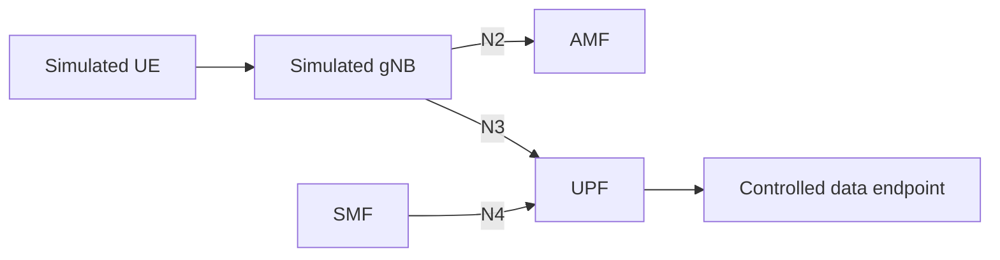

# D03 — Chosen lab environment and topology

> TEMPLATE — not evidence yet. Replace this notice with a real dated result after performing the work.

**Acceptance criterion:** Name the Linux path and draw all logical links with collision-checked lab addressing.

## Topology
Draw the actual setup after selecting it. Below is only a logical sketch, not deployment evidence.

Service-based control-plane interactions and other functions are omitted for readability. Document them if needed for the actual deployment.

Linux environment and namespaces: TBD
Interfaces/subnets and collision check: TBD
Traffic source, forward path and return path: TBD

## Result and explanation

Actual result: TBD
What I learned / why it matters: TBD
Limitations: TBD

## Reproduction and evidence

Date, environment, exact commands/steps: TBD
Reviewed evidence links or excerpts: TBD
Private raw evidence reference (no secrets or access tokens): TBD

## Before marking done

- [ ] I performed the work and checked the acceptance criterion.
- [ ] I replaced placeholders and linked actual evidence.
- [ ] I stated failures, unknowns and limits accurately.
- [ ] I reviewed staged content for secrets and private/operator data.
- [ ] I updated progress.json and regenerated the dashboard.
